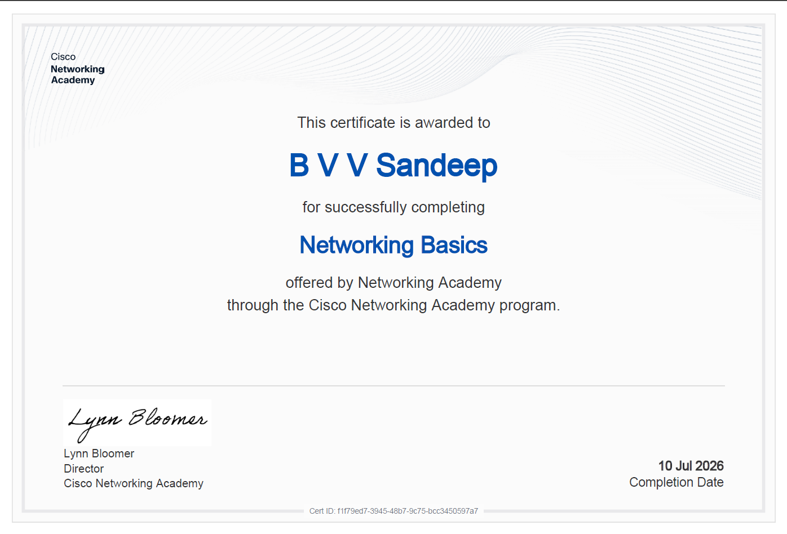
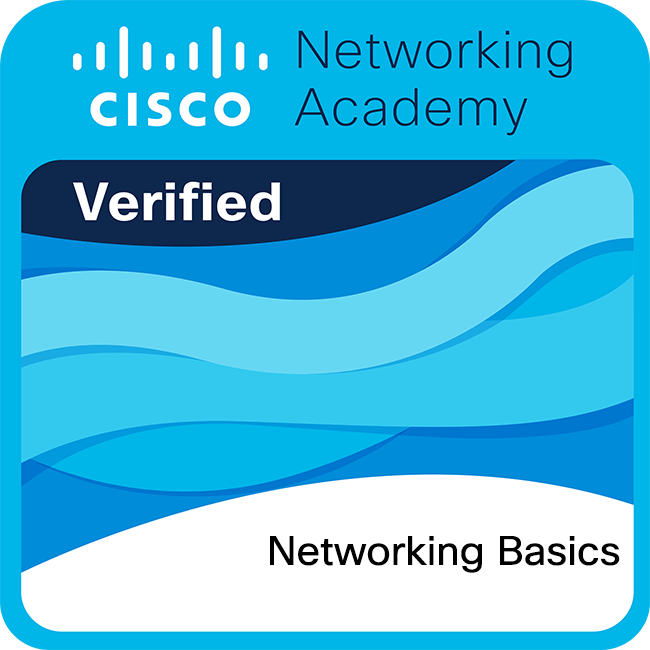

# 🌐 Networking Fundamentals Journey

## 📖 About

This section documents my journey of learning **Computer Networking fundamentals** as a foundation for my Cybersecurity and Cloud Security path.

Before diving deeper into security tools and cloud platforms, I focused on understanding how systems communicate, how data travels across networks, and how the internet actually works behind the scenes.

---

# Certification
 
 

# Badge
 

# 🚀 Learning Path

## 🧩 Starting With Network Basics

I began by understanding what computer networks are and why they are needed.

Learned about:

- How devices communicate
- Components involved in communication
- Different types of networks
- Network devices and their roles

This helped me understand how computers exchange information in real-world environments.

---

## 🏠 Understanding Real Networks

After learning the basics, I explored how everyday networks function.

Covered concepts like:

- Home networks
- Wireless communication
- Mobile networks
- Network media

This helped me connect theoretical concepts with the networks we use daily.

---

## 📦 Understanding Data Communication

The next step was learning how data moves between devices.

I explored:

- Communication rules
- Protocols
- Network layers
- Encapsulation concepts

This gave me a better understanding of how messages travel from one device to another.

---

## 🌍 Internet & IP Addressing

Then I moved into one of the most important networking concepts: **IP addressing**.

Learned:

- IPv4 addressing
- IPv6 addressing
- Network and host portions
- Address assignment
- Dynamic addressing using DHCP

Understanding IP addressing created the foundation for network troubleshooting and security.

---

## 🚦 Moving Across Networks

After understanding addressing, I explored how devices communicate beyond local networks.

Topics included:

- Gateways
- ARP process
- MAC address resolution
- Routing between networks

This helped me understand how packets find their destination.

---

## 🔄 Transport & Application Communication

Next, I learned how applications communicate over networks.

Covered:

- TCP
- UDP
- Ports
- Application layer protocols
- Client-server communication

This connected networking concepts with real applications like websites and services.

---

## 🛠️ Network Troubleshooting

Finally, I practiced network testing and troubleshooting utilities.

Tools explored:

```bash
ping
traceroute
ipconfig
ifconfig
nslookup
netstat
curl
```

These tools are important for:

- Network debugging
- Cybersecurity investigations
- Cloud troubleshooting

---

# 🔐 Connection With Cybersecurity

Learning networking helped me understand:

✔ How attackers and defenders view networks  
✔ How systems communicate  
✔ How vulnerabilities appear in networks  
✔ How security tools analyze traffic  
✔ How cloud networking works  

Networking forms the base for areas like:

- Penetration Testing
- SOC Analysis
- Digital Forensics
- Cloud Security

---

# 🛠️ Hands-On Practice

Practiced using:

- Cisco Networking Modules
- Cisco Packet Tracer
- Linux networking commands
- Windows troubleshooting tools

---

# 📚 Additional Resources

Created:

📌 Detailed module notes  
📌 Networking cheatsheet  
📌 Practical command references  

---

# 🎯 Outcome

By completing this section, I built a strong foundation in:

- Computer networking concepts
- IP communication
- Network troubleshooting
- Routing basics
- Common protocols
- Security-related networking knowledge

This marks the completion of my Networking Fundamentals phase.

Next step:

☁️ **Cloud Security Journey**

---

## Status

🟢 Cisco Networking Fundamentals Completed.

> Documenting my Cyber Security learning journey one step at a time 🚀