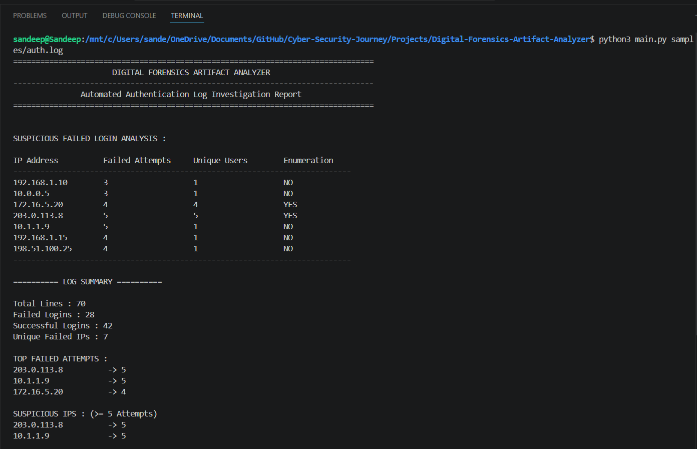
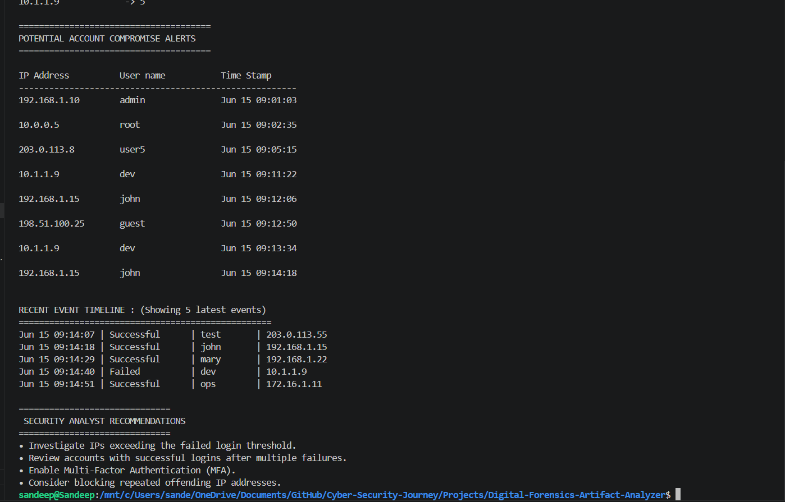

# <h1 align="center">🔍 Digital Forensics Artifact Analyzer</h1>

<p align="center">
A Python-based <b>Digital Forensics & Incident Response (DFIR)</b> tool for analyzing Linux SSH authentication logs, detecting suspicious login activity, and generating structured investigation reports.
</p>

<p align="center">


</p>

---

# 📖 Overview

Digital Forensics Artifact Analyzer is a modular command-line tool designed to automate the analysis of Linux SSH authentication logs.

Instead of manually reviewing hundreds of log entries, the tool extracts authentication events, identifies suspicious patterns such as brute-force attacks and username enumeration attempts, correlates security events, and generates a structured investigation report with actionable security recommendations.

This project was developed to demonstrate practical Python programming, Digital Forensics & Incident Response (DFIR), log analysis, and cybersecurity automation concepts.

---

# 🚀 Quick Start

## Clone the Repository

```bash
git clone https://github.com/<your-github-username>/Digital-Forensics-Artifact-Analyzer.git
cd Digital-Forensics-Artifact-Analyzer
```

## Run the Application

```bash
python main.py <log_file_path>
```

### Basic Example

```bash
python main.py sample_logs/sample_auth.log
```

### Optional Arguments

| Argument      | Description                                                   |
| ------------- | ------------------------------------------------------------- |
| `--threshold` | Minimum failed login attempts to classify an IP as suspicious |
| `--top_n`     | Number of top failed IP addresses displayed                   |
| `--savefile`  | Output path for the generated investigation report            |

### Example

```bash
python main.py sample_logs/sample_auth.log \
    --threshold 5 \
    --top_n 3 \
    --savefile reports/investigation_report.txt
```

---

# 📸 Screenshots

## Console Output





---

# ✨ Features

## 🔐 Authentication Analysis

* ✅ SSH Failed Login Detection
* ✅ SSH Successful Login Detection
* ✅ Configurable Suspicious IP Threshold

## 🚨 Threat Detection

* ✅ Brute Force Attack Detection
* ✅ Username Enumeration Detection
* ✅ Success-after-Failure Correlation

## 📊 Investigation & Reporting

* ✅ Structured Log Summary
* ✅ Top Failed Attempts Analysis
* ✅ Suspicious IP Identification
* ✅ Potential Account Compromise Alerts
* ✅ Recent Event Timeline
* ✅ Security Analyst Recommendations
* ✅ Automated Investigation Report Generation

---

# 🏗️ Architecture

```text
                  Authentication Log
                          │
                          ▼
                 parsers/auth_parser.py
                          │
                          ▼
                 analyzers/analyzer.py
                          │
                          ▼
                      report.py
                          │
                          ▼
      Console Output + Investigation Report
```

---

# 📂 Project Structure

```text
Digital-Forensics-Artifact-Analyzer/

├── analyzers/
│   └── analyzer.py
│
├── parsers/
│   └── auth_parser.py
│
├── reports/
│
├── sample_logs/
│
├── screenshots/
│   ├── screenshot1.png
│   └── screenshot2.png
│
├── report.py
├── main.py
├── README.md
└── requirements.txt
```

---

# 🛠️ Technologies Used

* Python 3
* Regular Expressions (`re`)
* File Handling
* Dictionaries
* Sets
* Command-Line Arguments (`argparse`)
* Modular Programming

---

# 📊 Detection Capabilities

| Capability                        | Status |
| --------------------------------- | :----: |
| SSH Failed Login Detection        |    ✅   |
| SSH Successful Login Detection    |    ✅   |
| Suspicious IP Analysis            |    ✅   |
| Brute Force Detection             |    ✅   |
| Username Enumeration Detection    |    ✅   |
| Success-after-Failure Correlation |    ✅   |
| Event Timeline Reconstruction     |    ✅   |
| Investigation Report Generation   |    ✅   |
| Security Analyst Recommendations  |    ✅   |

---

# 📋 Investigation Report

The generated investigation report includes:

* Suspicious Failed Login Analysis
* Log Summary
* Top Failed Attempts
* Suspicious IP Analysis
* Potential Account Compromise Alerts
* Recent Event Timeline (Latest 5 Events)
* Security Analyst Recommendations

---

# 🎯 Skills Demonstrated

This project demonstrates practical experience in:

* Python Automation
* Digital Forensics Fundamentals
* Linux SSH Authentication Log Analysis
* Incident Investigation
* Security Event Correlation
* Threat Detection Logic
* Report Generation
* Command-Line Tool Development
* Modular Software Design

---

# 🔮 Roadmap

* [ ] Multi-parser architecture
* [ ] Sudo log parser
* [ ] CRON log parser
* [ ] Apache/Nginx log parser
* [ ] JSON / CSV / PDF report export
* [ ] IP reputation enrichment
* [ ] Interactive dashboard

---

# 💡 Sample Workflow

```text
Authentication Log
        │
        ▼
Log Parsing
        │
        ▼
Threat Detection
        │
        ├── Failed Login Analysis
        ├── Brute Force Detection
        ├── Username Enumeration
        └── Success-after-Failure Correlation
        │
        ▼
Timeline Reconstruction
        │
        ▼
Investigation Report Generation
```

---

# 👨‍💻 Author

## Sandeep B

**Cybersecurity | Cloud Security | Digital Forensics Enthusiast**

Built as a portfolio project to demonstrate practical cybersecurity, Python automation, and Digital Forensics & Incident Response (DFIR) concepts.

---

⭐ **If you found this project useful, consider giving it a star!**
