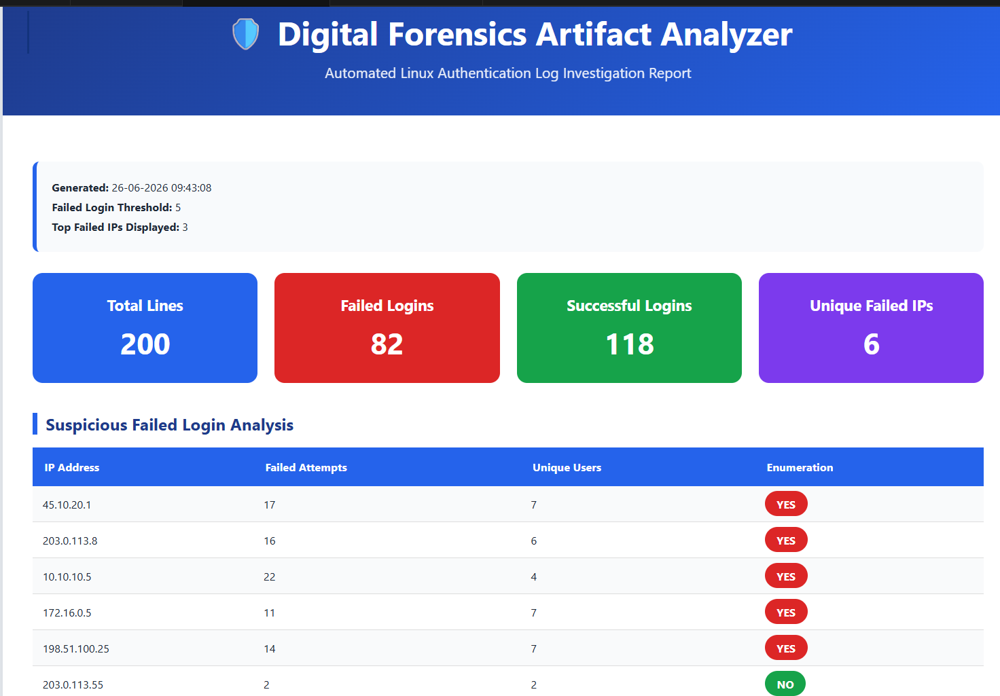
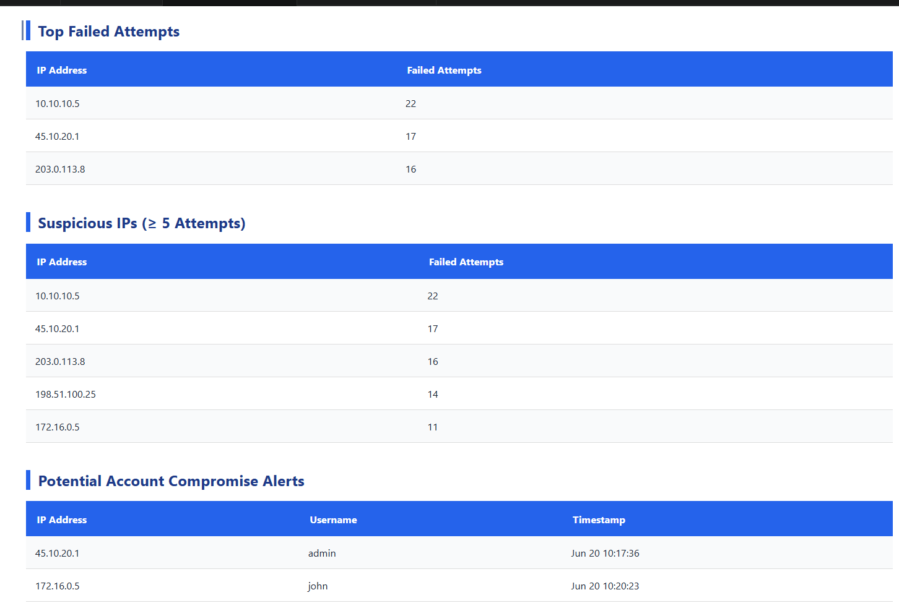
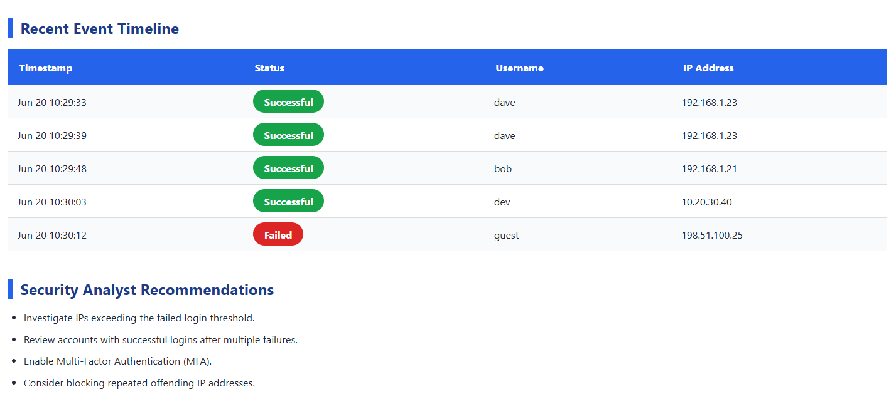
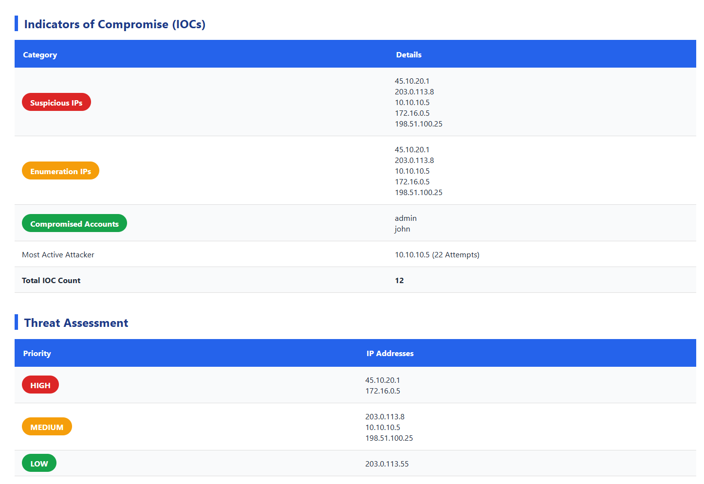
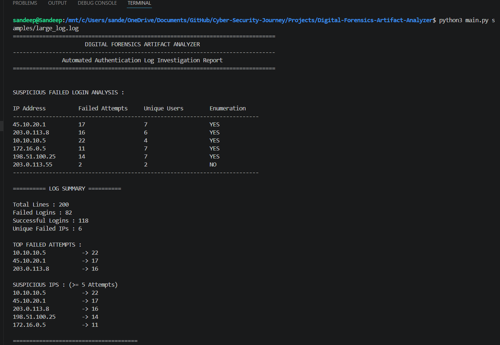
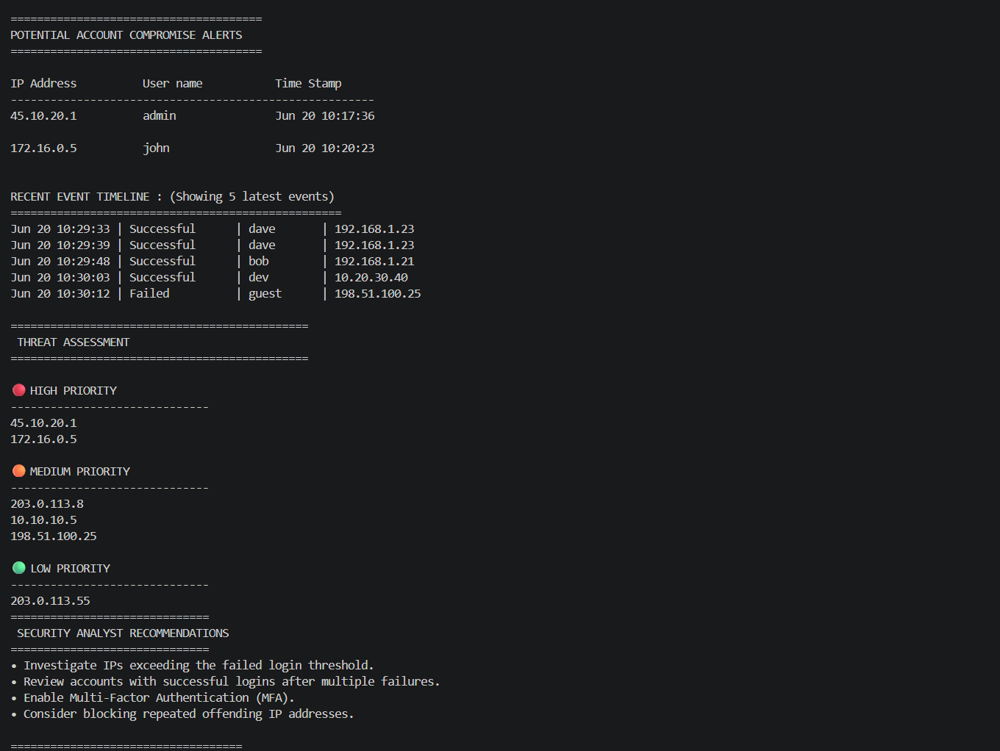
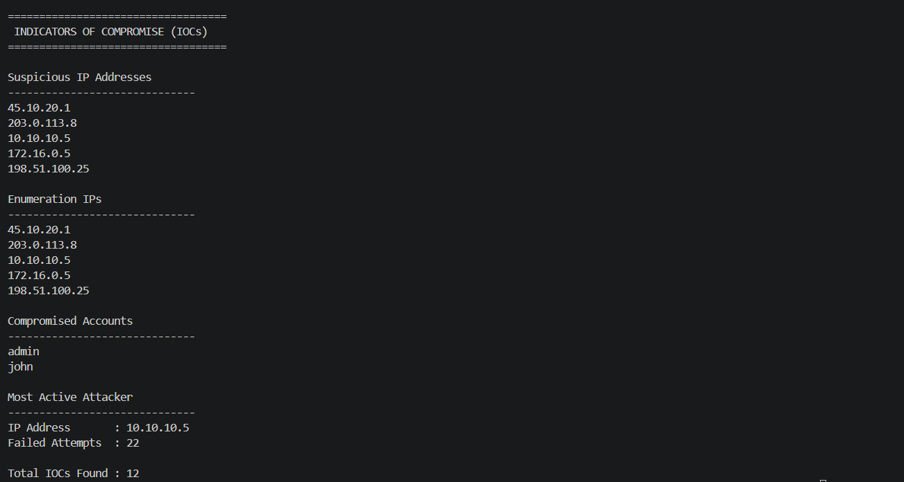

# 🛡️ Digital Forensics Artifact Analyzer

> **Automated Linux Authentication Log Investigation & Threat Analysis Tool**

<p align="center">


</p>

A Python-based **Digital Forensics & Incident Response (DFIR)** tool that automates Linux SSH authentication log analysis, detects suspicious activities, extracts Indicators of Compromise (IOCs), prioritizes threats, and generates professional investigation reports in multiple formats.

---

# 📑 Table of Contents

* [Overview](#-overview)
* [Quick Start](#-quick-start)
* [Features](#-features)
* [Project Highlights](#-project-highlights)
* [Architecture](#-architecture)
* [Project Structure](#-project-structure)
* [Command Line Options](#-command-line-options)
* [Investigation Report](#-investigation-report)
* [Screenshots](#-screenshots)
* [Technologies Used](#-technologies-used)
* [Skills Demonstrated](#-skills-demonstrated)
* [Future Improvements](#-future-improvements)
* [License](#-license)
* [Author](#-author)

---

# 📖 Overview

Digital Forensics Artifact Analyzer is a modular Python-based DFIR tool that automates the investigation of Linux SSH authentication logs.

Instead of manually reviewing hundreds of authentication events, the analyzer parses authentication logs, detects suspicious login activity, identifies brute-force attacks, extracts Indicators of Compromise (IOCs), classifies threat severity, and generates structured investigation reports.

The project demonstrates practical applications of:

* Python Automation
* Linux Log Analysis
* Digital Forensics
* Incident Response
* Threat Detection
* Security Automation

---

# 🚀 Quick Start

## Clone the Repository

```bash
git clone https://github.com/sandeep-7981/Digital-Forensics-Artifact-Analyzer.git

cd Digital-Forensics-Artifact-Analyzer
```

## Run the Analyzer

```bash
python main.py samples/auth.log
```

Generate HTML Dashboard

```bash
python main.py samples/auth.log --html
```

Generate JSON Report

```bash
python main.py samples/auth.log --json
```

Generate CSV Report

```bash
python main.py samples/auth.log --csv
```

Generate All Reports

```bash
python main.py samples/auth.log --html --json --csv
```

Custom Threshold

```bash
python main.py samples/auth.log --threshold 5 --top_n 3
```

---

# ✨ Features

## 🔐 Authentication Analysis

* Parse Linux SSH authentication logs
* Detect successful login attempts
* Detect failed login attempts
* Count failed attempts per IP
* Track unique targeted users
* Generate chronological authentication timeline

### 🚨 Threat Detection

* Brute Force Attack Detection
* Username Enumeration Detection
* Success-after-Failure Detection
* Suspicious IP Detection
* Compromised Account Detection

### 📌 Indicators of Compromise (IOC)

* Suspicious IP Extraction
* Enumeration IP Detection
* Compromised Account Identification
* Most Active Attacker Detection
* IOC Count Summary

### ⚠️ Threat Assessment

Automatically categorizes malicious activity into:

* 🔴 High Priority
* 🟠 Medium Priority
* 🟢 Low Priority

### 📄 Report Generation

Generate investigation reports in:

* TXT
* HTML Dashboard
* JSON
* CSV

---

# 📊 Project Highlights

| Metric                          |  Value |
| ------------------------------- | -----: |
| Authentication Events Processed |   200+ |
| Report Formats                  |      4 |
| Threat Levels                   |      3 |
| IOC Types                       |      5 |
| Detection Techniques            |      5 |
| Programming Language            | Python |

---

# 🏗️ Architecture

```text
                    Authentication Log
                            │
                            ▼
                 Authentication Parser
                            │
                            ▼
                    Detection Engine
                            │
             ┌──────────────┼──────────────┐
             ▼              ▼              ▼
      IOC Extraction   Event Timeline   Threat Assessment
             │              │              │
             └──────────────┼──────────────┘
                            │
                            ▼
                   Report Generation
             ┌────────┬────────┬────────┬────────┐
             ▼        ▼        ▼        ▼
            TXT      HTML     JSON      CSV
```

---

# 📂 Project Structure

```text
Digital-Forensics-Artifact-Analyzer/

├── analyzer/
│   ├── detection.py
│   ├── ioc.py
│   └── threat.py
│
├── parsers/
│   └── auth_parser.py
│
├── reports/
│   ├── txt_report.py
│   ├── html_report.py
│   ├── html_sections.py
│   ├── html_styles.py
│   ├── json_report.py
│   └── csv_report.py
│
├── output/
│
├── samples/
│   ├── auth.log
│   └── auth_test_200.log
│
├── screenshots/
│
├── main.py
├── README.md
└── requirements.txt
```

---

# ⚙️ Command Line Options

| Argument      | Description                                       |
| ------------- | ------------------------------------------------- |
| `--threshold` | Failed login threshold to classify suspicious IPs |
| `--top_n`     | Number of top failed IPs displayed                |
| `--savefile`  | Output TXT report path                            |
| `--html`      | Generate HTML dashboard                           |
| `--json`      | Generate JSON report                              |
| `--csv`       | Generate CSV report                               |

---

# 📄 Investigation Report

The analyzer automatically generates reports containing:

* Authentication Summary
* Failed Login Analysis
* Top Failed Attempts
* Suspicious IP Analysis
* Potential Account Compromise Alerts
* Recent Event Timeline
* Indicators of Compromise (IOC)
* Threat Assessment
* Security Analyst Recommendations

---

# 📸 Screenshots

## 🌐 HTML Dashboard

<p align="center">
  
</p>


<p align="center">
  
</p>
<p align="center">
  
</p>
<p align="center">
  
</p>
---

## 🖥️ Console Report

<p align="center">
  
</p>


<p align="center">
  
</p>


<p align="center">
  
</p>

---


# 🛠️ Technologies Used

* Python 3
* HTML
* CSS
* JSON
* CSV
* argparse
* collections
* datetime
* os
* Regular Expressions (`re`)

---

# 🎯 Skills Demonstrated

* Python Programming
* Digital Forensics
* Incident Response
* Linux Authentication Log Analysis
* Security Event Correlation
* Threat Detection
* IOC Extraction
* Threat Prioritization
* Report Generation
* CLI Development
* Modular Software Design

---

# 🔮 Future Improvements

* PDF Report Export
* Real-Time Log Monitoring
* Threat Intelligence Integration
* IP Reputation Enrichment
* Multi-Log Support
* Web Dashboard
* Docker Deployment

---

# 📜 License

This project is licensed under the **MIT License**.

---

# 👨‍💻 Author

## **B V V Sandeep**

**Cybersecurity • Cloud Security • Digital Forensics Enthusiast**

Built as a portfolio project to demonstrate practical applications of Python automation, Digital Forensics & Incident Response (DFIR), and cybersecurity analytics.

---

<p align="center">

⭐ If you found this project useful, consider giving it a ⭐ on GitHub!

</p>
